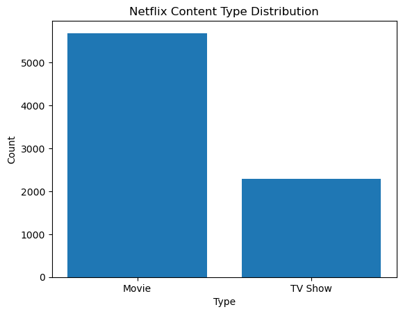
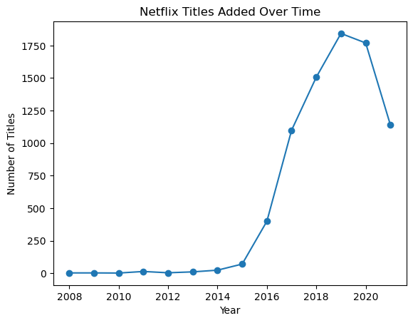
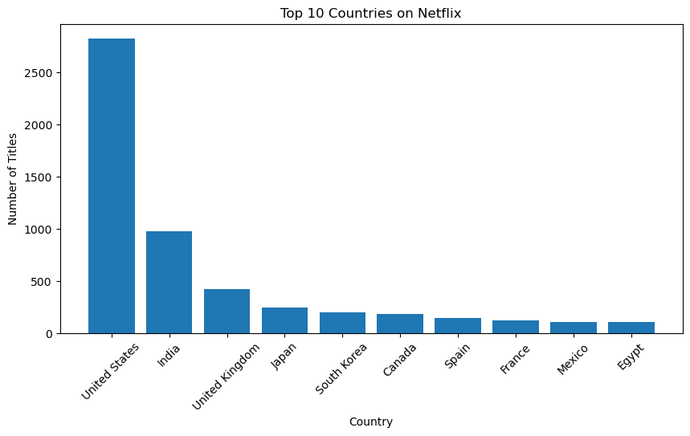
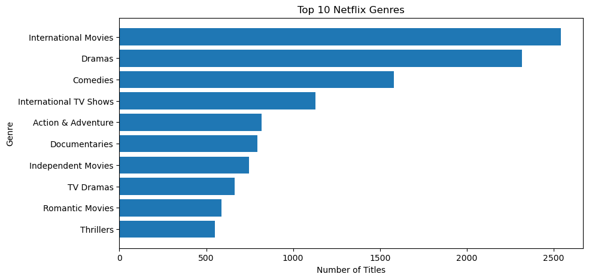
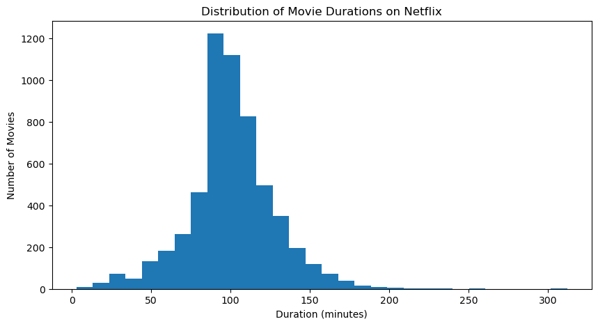

# Netflix Content Analysis

## Project Goal
Analyze Netflix's content library and identify trends in content production, genres, and geographic distribution, as well as understand patterns in movie duration and content growth over time.

## Tools
- Python
- Pandas
- Matplotlib
- Seaborn

## Key Findings
- Movies dominate the catalog compared to TV Shows, indicating a movie-heavy content strategy.
- Content addition increased sharply around 2016 and peaked around 2019, followed by a slight decline, suggesting a shift from rapid expansion to a more stable content strategy.
- The United States is the largest content producer, followed by India and the United Kingdom, showing strong concentration in major production markets.
- International Movies, Dramas, and Comedies are the most common genres, indicating a focus on globally appealing content.
- Movie durations are mostly clustered around 90–100 minutes, aligning with standard feature-film length.

## Visualizations
- Bar chart: Movies vs TV Shows distribution
- Line chart: Content added over time
- Bar chart: Top 10 countries producing Netflix content
- Bar chart: Most common genres
- Histogram: Distribution of movie durations

### Movies vs TV Shows

### Content Growth Over Time

### Top Countries

### Genres

### Movie Duration Distribution

## Dataset
Kaggle Netflix Titles Dataset